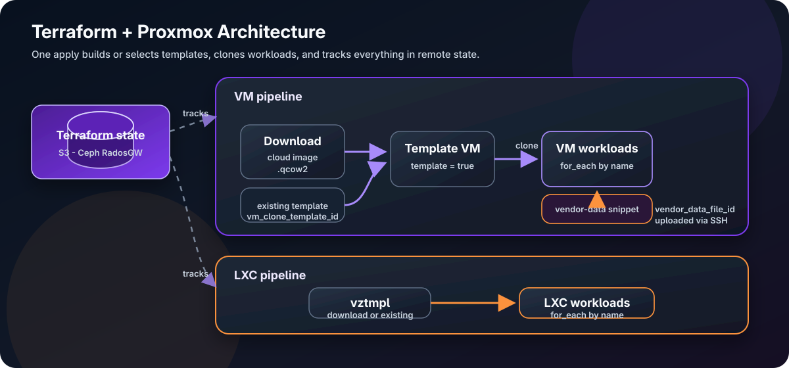
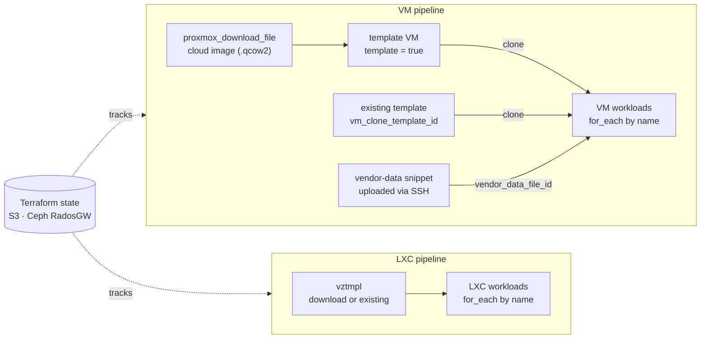
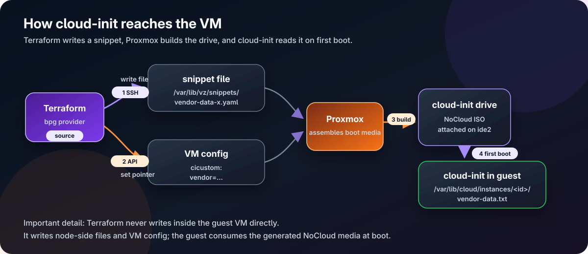
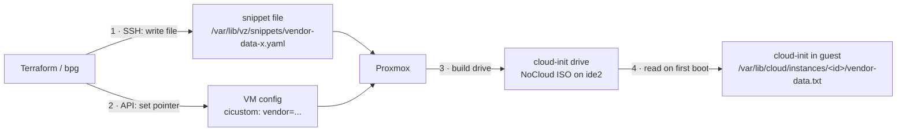

# From Clicking VMs to a Private Cloud: Terraform + Proxmox (the parts the docs skip)

<!--
COVER IMAGE PROMPT (paste into an image generator, 1200×630 for OG/social):
"A clean, modern technical illustration for a DevOps blog cover. Left side: a
mouse cursor clicking a cluttered server admin web UI (representing manual work).
An arrow labeled 'terraform apply' points right to a tidy grid of identical
glowing server/VM cards on a dark slate background, each tagged with a small
label. Subtle Terraform-purple and Proxmox-orange accent colors, isometric flat
vector style, minimal, lots of negative space, no text except the faint words
'terraform apply' on the arrow. 1200x630."

Alt text for accessibility: "Manual VM clicking on the left transforms via
'terraform apply' into a uniform fleet of tagged VMs on the right."
-->

I had a Proxmox cluster and a bad habit: every time I needed a VM, I clicked
through the web UI — clone a template, set the IP, paste an SSH key, tag it,
start it. It works for one VM. It does not work when "give me three identical
workers on this VLAN, tagged to project X" becomes a weekly request.

So I turned my Proxmox node into a small **self-service private cloud** with
Terraform: describe the fleet in code, `terraform apply`, done. This post is the
honest version — the architecture, the design decisions and *why* I made them,
and especially the **production gotchas that cost me hours and aren't on page one
of any search**.

If you want to read the module while following along, the public repository is here:

**Repository:** [terraform-proxmox-public](https://github.com/ahmad-knowledge-based/terraform-proxmox-public)

> TL;DR decisions
> - Provider: **`bpg/proxmox`** (not telmate) — it builds the template from a cloud image in Terraform.
> - VMs use **`for_each` keyed by name**, never `count`.
> - State on an **S3-compatible backend** (Ceph RadosGW).
> - Cloud-init: structured `user_account` **+** an optional **vendor-data** snippet to install the guest agent.
> - The hard parts were never the happy path — they were auth, checksums, file extensions, and cloud-init's first-boot model.

---

## When to use this (and when not to)

Be honest with yourself before adopting Terraform here. The web UI is genuinely
fine for **2–3 static pet VMs** you set once. Terraform earns its keep when:

- you provision or recreate VMs **regularly** (not once-and-forget);
- you have **more than a handful**, or they follow **patterns**;
- **multiple people** touch the infra and you want review + audit;
- you need **environments** (dev/stage/prod) or **fast teardown/rebuild**;
- you want self-hosted infra to behave like a **cloud** — self-service, tagged, reproducible.

The crossover point is simple: *the moment your cluster becomes "a platform other
people request VMs from," Terraform is the right call.* That's the
**private-cloud scenario** this whole post is built around.

---

## Architecture

The module does everything end-to-end in one `apply`:





Two stages: **build a golden template once** (download a cloud image, convert to
`template = true`), then **clone many workloads** from it. You can also point at a
template that already exists, or clone non-cloud-init templates.

---

## Key design decisions (and the *why*)

### 1. `bpg/proxmox`, not `telmate/proxmox`

The older `telmate` provider can only *clone* an existing template — it can't
download a cloud image or build the template for you. `bpg/proxmox` can do the
whole pipeline (`proxmox_download_file` → VM with `template = true`), is actively
maintained, targets PVE 9.x, and models cloud-init as a structured block. For a
"build it all in code" goal, bpg wins.

### 2. `for_each` keyed by VM name — never `count`

This is the single most important correctness decision. The difference isn't
"list vs map" — it's **how Terraform identifies each instance in state**:

- `count` addresses by **index**: `vm[0]`, `vm[1]`. Delete the middle one and
  every later VM's address shifts — Terraform **destroys and recreates** them.
  Catastrophic for VMs.
- `for_each` addresses by **stable key**: `vm["db-01"]`. Add or remove anything
  else and that address never moves.

```hcl
resource "proxmox_virtual_environment_vm" "workload" {
  for_each = var.workloads
  name     = each.key            # the map key IS the identity
  # ...
}
```

If you ever rename a key, use a `moved {}` block (reviewed, in code) rather than
`terraform state mv` on the CLI.

### 3. Tags enforced in `locals`, pre-sorted

Proxmox has no metadata map — just flat string tags. I enforce a tagging contract
(`environment-*`, `project-*`, `managed_by-terraform`) centrally so no VM can be
created without it, and I **sort** the list:

```hcl
workload_tags = {
  for name, spec in var.workloads :
  name => sort(distinct(concat(local.base_tags, spec.tags)))
}
```

Why sort? bpg stores tags in canonical sorted order. An unsorted input produces a
**perpetual diff** on every plan. (Gotcha #7 below.)

### 4. Guardrails as `precondition`s

VMIDs are cluster-unique; a collision is a painful runtime failure. A central
`terraform_data.id_guard` fails the **plan** before touching anything:

- duplicate VMIDs within the config,
- a requested VMID already used by a foreign VM on the cluster (live data source),
- invalid template-source combos,
- `use_cloud_config` without SSH, ballooning floor > memory, cloud-init without an IP.

Catching mistakes at plan time is the whole point of IaC.

### 5. Cloud-init: structured `user_account` + a vendor-data snippet

bpg gives you structured cloud-init (`ciuser`, `sshkeys`, `ipconfig`) over the
API — no extra plumbing. But it can't install packages. To get
`qemu-guest-agent` onto the guest, I add a **vendor-data** snippet. Crucially I
use `vendor_data_file_id`, **not** `user_data_file_id`, because the latter
*conflicts* with `user_account`. Vendor-data is *merged* with user-data, so I keep
the structured users/keys **and** layer on packages + `runcmd`:

```hcl
vendor_data_file_id = var.use_cloud_config ? proxmox_virtual_environment_file.vendor_data[each.key].id : null
```

---

## The gotchas nobody documents

This is the part I wish I'd read before starting. Each one cost real time.

### Gotcha #1 — RadosGW state: `XAmzContentSHA256Mismatch`

```
Error: Failed to save state
... api error XAmzContentSHA256Mismatch: UnknownError
```

I'm storing state on Ceph RadosGW (S3-compatible). The backend has
`skip_s3_checksum = true`, yet state saves still failed. The cause: **Terraform
≥ 1.11.2 ignores `skip_s3_checksum` on `PutObject`** — the AWS SDK v2 computes a
content checksum the non-AWS gateway rejects. The fix is SDK-level env vars:

```fish
set -Ux AWS_REQUEST_CHECKSUM_CALCULATION when_required
set -Ux AWS_RESPONSE_CHECKSUM_VALIDATION when_required
```

Keep `skip_s3_checksum = true` too; the env vars are the missing piece. This
applies to MinIO and other S3-compatible stores as well.

### Gotcha #2 — API token: `401`, then `403 Permission check failed`

Two *different* errors people conflate:

- **401 Authentication failed** = bad credential. Token format must be
  `user@realm!tokenid=SECRET`; the secret is shown only once at creation.
- **403 Permission check failed** = authenticated but not authorized. Two traps
  here:
  - **Privilege separation** — tokens start with **zero** rights even if their
    user is admin. Grant a role *to the token*.
  - Even with `PVEAdmin`, downloading a cloud image fails, because
    `query-url-metadata` requires **`Sys.AccessNetwork`** — a privilege
    `PVEAdmin` does **not** include (it's a newer SSRF-mitigation privilege).

```bash
pveum role add TerraformNet --privs "Sys.AccessNetwork"
pveum acl modify / --roles TerraformNet --tokens 'terraform@pve!tf'
```

### Gotcha #3 — `import` content rejects `.img`

```
Error: 400 ... (filename: invalid filename or wrong extension)
```

The `import` content type only accepts `.qcow2`, `.raw`, `.vmdk`, `.ova`. Ubuntu's
`*-cloudimg-amd64.img` files are *actually qcow2* despite the name. Download from
the `.img` URL but store with a `.qcow2` extension:

```hcl
template = {
  image_url       = "https://cloud-images.ubuntu.com/jammy/current/jammy-server-cloudimg-amd64.img"
  image_file_name = "jammy-server-cloudimg-amd64.qcow2"   # <-- the fix
  # ...
}
```

### Gotcha #4 — QEMU agent timeout makes plans crawl

```
Warning: error waiting for network interfaces from QEMU agent
timeout while waiting for the QEMU agent on VM "784"
```

If you enable the agent in Terraform but the guest isn't running
`qemu-guest-agent`, bpg blocks until a timeout on every started VM. Don't enable
the agent until the guest actually runs it. I made it a toggle defaulting to off,
and install the agent via the vendor-data snippet first — *then* enable it.

### Gotcha #5 — Snippets are uploaded over SSH, not the API

`proxmox_virtual_environment_file` with `content_type = "snippets"` needs the
provider's `ssh` block. Why? **The Proxmox REST API has no endpoint to upload a
snippet file.** Native cloud-init fields are API config values (no SSH), but a
custom user/vendor-data snippet is a *file* in the datastore's `snippets/`
directory, so bpg SSHes in and writes it. Requirements: an `ssh` block, and the
datastore must have the **Snippets** content type enabled.

### Gotcha #6 — cloud-init is first-boot-only (and the password is invisible)

Changed a cloud-init password in `tfvars` and got "No changes"? Two reasons:

- Proxmox returns `cipassword` **masked** (`**********`), so the provider can't
  diff it.
- cloud-init's user/password module runs **once, on first boot**. Editing it does
  nothing to a VM that already booted.

For day-2 password changes on a running VM, use `passwd` in the guest. To re-seed,
recreate the VM (`terraform apply -replace=...`). Same applies to vendor-data
snippets — they apply on first boot.

### Gotcha #7 — `cicustom` is invisible in the GUI

Your vendor-data reference lives in `cicustom`, which the Proxmox web UI's
Cloud-Init tab does **not** show. It's CLI/API only:

```bash
qm config 784 | grep cicustom        # vendor=local:snippets/vendor-data-x.yaml
cat /var/lib/vz/snippets/vendor-data-x.yaml
# note: `qm cloudinit dump` only supports user|network|meta — NOT vendor
```

Upside: Terraform is the single source of truth and nobody can silently change it
in the UI.

### Bonus: don't put `file()` in `terraform.tfvars`

```
Error: Functions may not be called here.
```

`.tfvars` files take **literal values only**. Pass a *path* string in tfvars and
call `file()` inside a `.tf` file:

```hcl
# tfvars: a literal path
proxmox_ssh = { username = "root", private_key_file = "/home/me/.ssh/id_ed25519" }

# providers.tf: the function call lives here
private_key = file(pathexpand(ssh.value.private_key_file))
```

---

## How cloud-init actually reaches the VM

This flow confuses everyone, so here it is explicitly. Terraform does **not** write
into the VM. It writes a file to the node and sets a pointer; Proxmox assembles the
media the guest reads at boot:





The files you find under `/var/lib/cloud/instances/.../vendor-data.txt` inside the
VM are step [4] — proof the whole chain worked.

---

## A real scenario: a 3-tier app in one `apply`

```hcl
# terraform.tfvars (excerpt)
use_cloud_config = true
proxmox_ssh      = { username = "root", private_key_file = "/home/me/.ssh/id_ed25519" }

workloads = {
  "web-01" = { cores = 2, memory = 4096, ip_address = "10.0.0.11/24", gateway = "10.0.0.1", tags = ["role-web"] }
  "web-02" = { cores = 2, memory = 4096, ip_address = "10.0.0.12/24", gateway = "10.0.0.1", tags = ["role-web"] }
  "db-01"  = { cores = 4, memory = 8192, ip_address = "10.0.0.21/24", gateway = "10.0.0.1", tags = ["role-db"] }
}

lxc_workloads = {
  "proxy-01" = { cores = 1, memory = 512, ip_address = "10.0.0.5/24", gateway = "10.0.0.1", tags = ["role-proxy"] }
}
```

`terraform apply` → two web VMs, a database VM, and an LXC reverse proxy, all
tagged, agent-equipped, reproducible. Need two more web nodes? Add two map
entries. Tear it all down for the night? `terraform destroy`. That's the private
cloud.

---

## Testing before you trust it in production

A condensed checklist (full plan in the repo):

1. **Prereqs:** token authn (curl), `Sys.AccessNetwork`, SSH works, datastores have
   `import`/`snippets` content, RadosGW bucket exists, checksum env vars set.
2. **Idempotency:** `apply` twice → "No changes."
3. **`for_each` safety:** add/remove a workload → others untouched (no recreate).
4. **Guardrails (negative tests):** duplicate VMID, cluster collision, snippet
   without SSH — each must **fail at plan**.
5. **Cloud-init end-to-end:** recreate a VM with the snippet → `qemu-guest-agent`
   active, IPs reported once `qemu_agent_enabled = true`.
6. **Drift:** change a VM in the GUI → `plan` flags it.
7. **Teardown:** `destroy` leaves nothing orphaned.

---

## Takeaways

- The **best reason** to use Terraform on Proxmox is *infrastructure you can
  recreate, review, and reason about as code* — the UI gives you a running system;
  Terraform gives you a reproducible definition of it.
- The happy path is easy. The value of writing it down is the **gotchas**:
  RadosGW checksums, token privileges (`Sys.AccessNetwork`), the `.qcow2`
  extension rule, the agent timeout, cloud-init's first-boot model, and snippets
  needing SSH.
- Pick **bpg**, key with **`for_each`**, enforce **tags + guardrails** in code,
  and treat **cloud-init as first-boot**.

If you're running self-hosted infra that's growing into a platform, this is the
point where clicking stops scaling and code starts paying off.

The full Terraform module, examples, and README are available in the public repo:
[terraform-proxmox-public](https://github.com/ahmad-knowledge-based/terraform-proxmox-public).
